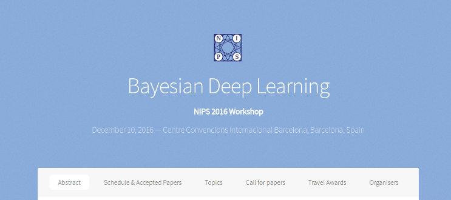
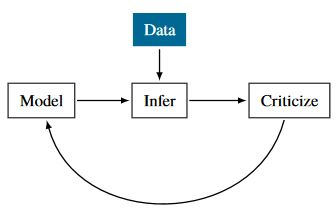
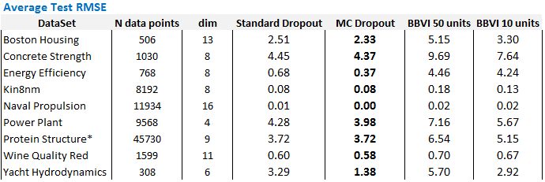

## Roadmap 

- Bayesian Deep Learning
- Probabilistic Programming with Edward
- Dropout as a Bayesian Approximation in Deep Neural Networks
- Experiments

# Bayesian Deep Learning


## Deep Learning {.small_text}

<div class="columns-2">


- State of the art in a wide range of applications: computer vision, speech recognition, natural language processing etc.

- Neural network architectures: Feedforward, Recurrent, Convolutional...

- Deeper neural networks and massive datasets: stochastic gradient descent, backpropagation, dropout

- Deep Reinforcement Learning: represent Q-value functions, which estimate quality of an agent's next action, as deep neural networks

</div>


## Drawbacks of Standard Deep Learning 


>- Neural networks compute point estimates

>- Neural networks make overly confident decisions about the correct class, prediction or action

>- Neural networks are prone to overfitting

>- Neural networks have many hyperparameters that may require specific tuning

## Probabilistic Machine Learning 

<div class="blue2"> **Aim**: Use probability theory to express all forms of uncertainty 
</div>

- Uncertainty estimates needed in forecasting, decision making, learning from limited and noisy data

- AI Safety: medicine, engineering, finance, etc.

- The probabilistic approach provides a way to **reason about uncertainty** and **learn from data**

<!--Bludell 2015: Uncertainty can be used to drive exploration in RL using Thomson sampling: greater uncertainty leads to more variablity in decision making and hence more exploration. -->

<!-- ## The General Inference Problem | In a Nutshell

- Inference: we have a model $p(\mathbf{x}, \mathbf{z})$ where
+ $\mathbf{x}$ : observed data
+ $\mathbf{z}$ : latent random variables

- We want to find $p(\mathbf{z} \vert \mathbf{x})$ : the posterior probability distribution of our latent random variables $\mathbf{z}$ given our observed data $\mathbf{x}$

$$ p(\mathbf{z} \vert \mathbf{x}) =  \frac{p(\mathbf{x}, \mathbf{z})}{p(\mathbf{x})}$$

- We usually can’t compute the denominator - the marginal $p(\mathbf{x})$ - exactly -->

## Bayesian Neural Networks 

<div class="blue2"> 
A Bayesian neural network is a neural network with a prior distribution on the weights
</div>

>- Accounts for uncertainty in weights

>- Propagates this into uncertainty about predictions

>- More robust against overfitting: randomly sampling over network weights as a cheap form of model averaging

>- Can infer network hyperparameters by marginalising them out of the posterior distribution

##  Bayesian Neural Networks

- Data $\mathcal{D} = \{\mathbf{X}_i, y_i \}_{i=1}^{N}$ for input data point $\mathbf{X}_i \in \mathbb{R}^d$ and output $y_i \in \mathbb{R}$.

- Parameters: network weights $\mathbf{w}$ and biases $b$. 


- For Bayesian neural networks **normal priors** are often used: $p(\mathbf{w)} =  \mathcal{N}(\mu, \Sigma)$ <!--Check this expression -->

## Bayesian Neural Networks

<!-- - Probabilistic model $p(\mathcal{D},\mathbf{w})$ -->

- Posterior: $p(\mathbf{w} \vert \mathbf{X},y) = \frac{\displaystyle{ p(y \vert \mathbf{X}, \mathbf{w}   )p(\mathbf{w}) }} { \displaystyle{p(y\vert \mathbf{X})} }$

- Predictive distribution of output $y^*$ given a new input $\mathbf{x}^*$: $$p(y^* \vert \mathbf{x}^*, \mathbf{X}, y) = \int p(y^* \vert \mathbf{x}^*, \mathbf{w})p(\mathbf{w} \vert \mathbf{X}, y) d\mathbf{w}$$

<div class="centered">

</div>
<div class="centered">
<div class="small_caption"> http://edwardlib.org/ </div> </div>

## Bayesian Neural Networks {.flexbox .vcenter}

>- <div class="red2"> **But exact inference is intractable!** </div>

>- Need to **approximate** the weight posterior $p(\mathbf{w} \vert \mathbf{X},y)$


## History of Bayesian Neural Networks

### Approximate Inference in Bayesian Neural Networks
- Laplace Approximation - David MacKay (1992) <!--PhD Thesis-->
- Minimal Description Length - Hinton & Van Kamp (1993)
- Hamiltonian Monte Carlo - Radford Neal (1995)
- Ensemble Learning - Barber & Bishop (1998)

<div class="red">
>- Methods not **scalable** for modern applications and massive data sets
</div>

<div class ="small_cite"> See Zoubin Ghahramani's NIPS 2016 keynote address on 'History of Bayesian Neural Networks': <https://www.youtube.com/watch?v=FD8l2vPU5FY> </div>


## Modern Revival: Bayesian Deep Learning 
 
<div class="centered"> </div>

**NIPS 2016:** bayesiandeeplearning.org

## Modern Revival: Bayesian Deep Learning 

<div class="small_cite">
- *Practical Variational Inference for Neural Networks*, A Graves, NIPS 2011. 

- *Auto-Encoding Variational Bayes*, D P. Kingma, M Welling, CoRR abs/1312.6114, 2013.

- *Stochastic Backpropagation and Approximate Inference in Deep Generative Models*, D Rezende, S Mohamed, and D Wierstra, ICML 2014. 

- *Weight uncertainty in neural networks*, C Blundell, J Cornebise, K Kavukcuoglu, and D Wierstra, ICML 2015.

- *Probabilistic backpropagation for scalable learning of Bayesian neural networks*, J M Hernandez-Lobato, R P Adams, ICML 2015

- *Dropout as a Bayesian Approximation: Representing Model Uncertainty in Deep Learning*, Y Gal, Z Ghahramani, ICML 2016
</div>

See Yarin Gal's PhD thesis: *Uncertainty in Deep Learning*, University of Cambridge (2016)


# Probabilistic Programming with Edward

## Probabilistic Programming | Overview 

<!---Dan Roy: https://www.youtube.com/watch?v=TFXcVlKqPlM--->
- Represent probabilistic models as **programs** that generate **samples**


- Automate inference of **unobserved** variables in the model **conditioned** on observed progam output 

- **Probabilistic Programming Languages** (PPLs): Church, Venture, Anglican, Figaro, WebPPL, Stan, PyMC3, Edward etc.

<!---- Programs allow stochastic control flow, PGMs are a subset--->
- Many PPLs treat inference as a **black box** abstracted away from model


- Separation of model and inference: harder to represent some recent advances, e.g. Generative Adversarial Networks <!--Edward supports non-Bayesian methods such as generative adversarial networks (GANs)--> 

>- <div class="blue2"> **Expressivity versus Scalability trade-off** </div>

## Probabilistic Programming {.flexbox .vcenter}

*"All sufficiently complex PPLs eventually reimplement probabilistic LISP."* 

Daniel Roy, University of Toronto

##Edward | edwardlib.org

- Edward is a thin platform over TensorFlow

>- Edward = TensorFlow 

##Edward | edwardlib.org

- Edward is a thin platform over TensorFlow

- Edward = TensorFlow + Random Variables 

## Edward | edwardlib.org

- Edward is a thin platform over TensorFlow

- Edward = TensorFlow + Random Variables + Inference Algorithms

## A brief diversion into TensorFlow

- TensorFlow is a **computational graph** framework 

- Graph **nodes** are **operations**: arithmetic, looping, indexing etc. 

- Graph **edges** are **tensors** representing data communicated between nodes

- Do everything in the computational graph: scale, distribute, GPU etc.

<div class="small_cite">*TensorFlow: Large-Scale Machine Learning on Heterogeneous Distributed Systems*, White Paper, M Abadi et al (2015)</div>

## Edward | Models 

Edward's **Random Variables** are **class objects** with methods: ```log_prob()```, ```samples()```, summary statistics etc.

#### How to embed **random variables** into the computational graph?

- A random variable $\mathbf{x}$ wraps a TensorFlow tensor $\mathbf{x^*}$, where $\mathbf{x^*} \sim p(\mathbf{x})$ is a **sample** from the random variable object 
<!--The number of random variables in an object is determined by the dimension of its parameters-->

<!-- - A random variable $\mathbf{x}$ is parameterised by tensors $\mathbf{\theta^*}$ -->

>- <div class = "blue2"> **Use this to define probabilistic models** </div>

## Edward | Inference

- Edward's ``Inference`` algorithms define a TensorFlow computational graph

- Inference can be written as a collection of separate inference programs

- Leverage TensorFlow **optimisers**, e.g. ADAM for Variational Inference; gradient structure for Hamiltonian Monte Carlo

## Edward | Expressivity and Scalability 

- Allows composition of Models *and* of Inference methods for greater **expressivity**


- Allows data subsampling for greater **scalability**


## Edward Philosophy 

George Edward Pelham Box's loop as a Design Principle 

    1.    Build a model of the science
    2.    Infer the model given data
    3.    Criticize the model given data (Posterior Predictive Checks)

<div class="centered">  </div>

<div class="small_cite"> Dustin Tran, Alp Kucukelbir, Adji B. Dieng, Maja Rudolph, Dawen Liang, and David M. Blei. 2016. *Edward: A library for probabilistic modeling, inference, and criticism.* arXiv preprint arXiv:1610.09787.</div>

<div class="small_cite"> Dustin Tran, Matthew D. Hoffman, Rif A. Saurous, Eugene Brevdo, Kevin Murphy, and David M. Blei. 2017. *Deep Probabilistic Programming.* International Conference on Learning Representations.</div>

## 2-Layer Neural Network in TensorFlow

```{python, echo=TRUE, eval=FALSE}
import tensorflow as tf

def neural_network(x, W_0, W_1, W_2, b_0, b_1, b2):
  h = tf.tanh(tf.matmul(x, W_0) + b_0)    
  h = tf.tanh(tf.matmul(h, W_1) + b_1)
  h = tf.matmul(h, W_2) + b_2
  return tf.reshape(h, [-1]) 
```

## 2-Layer Neural Network in TensorFlow + Edward

```{python, echo=TRUE, eval=FALSE}
import tensorflow as tf

def neural_network(x, W_0, W_1, W_2, b_0, b_1, b2):
  h = tf.tanh(tf.matmul(x, W_0) + b_0)    
  h = tf.tanh(tf.matmul(h, W_1) + b_1)
  h = tf.matmul(h, W_2) + b_2
  return tf.reshape(h, [-1]) 
```


```{python, echo=TRUE, eval=FALSE}
from edward.models import Normal

W_0 = Normal(loc=tf.zeros([D, n_hidden]), scale=tf.ones([D, n_hidden]))      
W_1 = Normal(loc=tf.zeros([n_hidden, n_hidden]), scale=tf.ones([n_hidden, n_hidden]))
W_2 = Normal(loc=tf.zeros([n_hidden, 1]), scale=tf.ones([n_hidden, 1]))
b_0 = Normal(loc=tf.zeros(n_hidden), scale=tf.ones(n_hidden))
b_1 = Normal(loc=tf.zeros(n_hidden), scale=tf.ones(n_hidden))
b_2 = Normal(loc=tf.zeros(1), scale=tf.ones(1))
```

## Inference in Edward

<!-- Posit some approximating family of posterior distributions $q(\mathbf{w})$ for the latent variables $\mathbf{w}$ and $\mathbf{b}$: the network weights and biases --> <!-- DPP p. 13-->

<!--    + **Variational Inference** algorithms posit some approximating family of posterior distributions $q_\theta(\mathbf{w})$ and seek the *closest* member of this family to the real posterior
    + **Monte Carlo** algorithms approximate the real posterior as an empirical distribution (bag of samples) -->

- Let ``x`` and ``y`` be observed random variables, and ``x_train`` and ``y_train`` be atually observed data 
- Let ``w_0``, ``w_1``, ``b_0`` and ``b_1`` be latent variables in model
- Let ``qw_0``, ``qw_1``, ``qb_0`` and ``qb_1`` be random variables defined to approximate the posterior 

>- Bind model latent random variables to posterior random variables: ```{w_0: qw_0, b_0: qb_0, w_1: qw_1, b_1: qb_1}```

>- Bind observed random variable to the training data: ```{x: x_train, y: y_train}```

## Inference in Edward 

- Select some inference algorithm (e.g. Variational Inference, Monte Carlo)

```{python, echo=TRUE, eval = FALSE}
inference = ed.Inference(latent_vars={w_0: qw_0, b_0: qb_0, 
                                      w_1: qw_1, b_1: qb_1}, 
                         data={x: x_train, y: y_train})
```
<!--- Edward has a base Inference() class, from which all inference methods VI, MCMC are inherited --->
>- <div class = "blue2"> **This abstraction can represent a broad class of inference algorithms** </div>


<!--Graves (2011) considers a similar problem for neural networks, but a lack of control variates limits the algorithm to significantly simpler variational approximation. (Paisley et al 2012) -->

## Variational Inference | Recasting Bayesian inference as optimisation

- Approximate the posterior $p(\mathbf{w} \vert \mathbf{X, Y})$ with a simpler distribution from a variational family of distributions $q_{\theta}(\mathbf{w})$ parameterised by $\theta$ 


- **Minimise** the Kullback-Leibler (KL) divergence between **approximate** posterior $q_{\theta}(\mathbf{w})$ and the **actual** posterior $p(\mathbf{w} \vert \mathbf{X, Y})$ w.r.t. $\theta$

- **Mean Field** approximation: factorise the approximating posterior $q_{\theta}(\mathbf{w})$ into **independent** distributions for each weight layer

>-  <div class="red2"> But minimising KL divergence is **hard**! (because of the *evidence* term $\text{log }  p(\mathbf{Y}| \mathbf{X})$!) </div>

>- <div class="red2"> Minimising the KL divergence = **maximising** the **Evidence Lower BOund (ELBO)** w.r.t. $\theta$</div>


<!-- ## 5 Steps to Variational Inference

1. **Goal**: minimise the KL divergence between approximating posterior and actual posterior w.r.t. $\theta$

2. Minimising KL divergence = Maximising the ELBO

3. Need to estimate ELBO and its gradient to optimise

4. For certain models: can use conjugate priors to get a closed form expression 

5. For Black Box VI: estimate gradient of ELBO numerically using Monte Carlo (score functions, reparameterisation trick) -->

<!-- ## Variational Inference 

- Consider general case of observed data $\mathbf{x}$ and latent variables $\mathbf{z}$

$$\text{ELBO} = \mathbb{E}_{q_{\theta}} [\log p(\mathbf{x}, \mathbf{z}) - \log q_{\theta}(\mathbf{z})]$$

- If KL divergence between the variational model $q_{\theta}(\mathbf{z})$ and the prior $p(\mathbf{z})$ is tractable, then this objective can be written:
    
$$\text{ELBO} = \mathbb{E}_{q_{\theta}}[\log p(\mathbf{x} \vert \mathbf{z})] - \text{KL}( q_{\theta}(\mathbf{z}) \| p(\mathbf{z}) ]$$
-->

## Variational Inference | Evidence Lower Bound

$$\text{ELBO} = \underbrace{\mathbb{E}_{q_{\theta}}[\log p(\mathbf{x} \vert \mathbf{z})]}_\text{Expected Log Likelihood} - \underbrace{ \text{KL}( q_{\theta}(\mathbf{z}) \| p(\mathbf{z})] }_\text{Prior KL}$$

>- **Expected Log Likelihood**: measures how well samples from approximate posterior $q_{\theta}(\mathbf{z})$ explain data $\mathbf{x}$ *(reconstruction cost)*

>- **Prior KL**: ensures explanation of doesn't deviate too far from our prior beliefs *(penalises complexity)*

<!-- ## Variational Inference | Bayesian Neural Networks

For a Bayesian neural network, this objective is:
$$\mathcal{L}_{VI}(\theta) = \int q_{\theta}(\mathbf{w})\text{ log } p(\mathbf{Y} \vert {\mathbf{X, \mathbf{w}}})d\mathbf{w} - \text{KL } (q_{\theta}(\mathbf{w}) \| p(\mathbf{w})) $$ 
<!--This enforces Occam's razor, penalises model complexity -->
<!--This is a lower bound on the evidence: log p(x) = KL( q(z) || p(z|x) ) + ELBO(q) -->
 
 
<!--Optimising the Lower Bound-->
## Variational Inference | Estimating the gradient

<!-- - An unbiased approximation of the gradient of the ELBO allows stochastic gradient descent to scalably learn complex models--> <!--Duvenaud 2017-->
- **Optimise** the ELBO <!--see BBVI paper, pg 2 -->: need unbiased estimator of its **gradient** 

<!-- Need an approximation of  **Expected Log Likelihood** $\int q_{\theta}\text{ log } p(\mathbf{Y} \vert {\mathbf{X, \mathbf{w}}})d\mathbf{w}$ and its **gradient**  

>- **Gradient of ELBO**: estimate using Monte Carlo sampling from the variational posterior $q_{\theta}(\mathbf{w})$ *(score functions, reparameterisation trick)*  
    
<!-- >- For **normal** distributions, the KL prior term can be computed **analytically** -->

>- No assumptions made about underlying model: 'black box' approach for **scalable** learning of complex models
    


>- <div class = "red2"> Problem: high variance of Monte Carlo estimator of the gradient! </div> 


## Black Box Variational Inference with Edward
<!-- https://github.com/blei-lab/edward/blob/master/edward/inferences/klqp.py -->
<!-- class KLqp(VariationalInference)-->
<!-- Variational inference with KL divergence $KL( q(z; \lambda) \| p(z \vert x) )$ -->

- Edward minimises the objective by automatically selecting from a variety of **black box** inference techniques 

- Edward applies variance reduction to the Monte Carlo gradient estimator

- Edward computes the Prior KL automatically when $p(\mathbf{z})$ and $q_{\theta}(\mathbf{z})$ are Normal 

- Allows Black Box Variational Inference to be implemented in a wide variety of models

<!-- ``KLqp`` optimizes model parameters $p(z \vert x; \theta)$ by minimizing $\mathbb{E}_{q(z; \lambda)} [ \log p(x, z; \theta) ]$ with respect to $\theta$ (variational EM) -->
  
 <!--  <https://github.com/blei-lab/edward/blob/master/edward/inferences/klqp.py>
- In conditional inference, we infer $z$ in $p(z, \beta \vert x)$ while fixing inference over $\beta$ using another distribution $q(\beta)$

- During gradient calculation, instead of using the model's density $\log p(x, z^{(s)}), z^{(s)} \sim q(z; \lambda)$ for each sample $s=1,\ldots,S$, ``KLqp`` uses $\log p(x, z^{(s)}, \beta^{(s)})$, where $z^{(s)} \sim q(z; \lambda)$ and $\beta^{(s)} \sim q(\beta)$ -->

<!-- def initialize(self, n_samples=1, kl_scaling=None, *args, **kwargs): -->
<!-- def build_loss_and_gradients(self, var_list): -->

<!-- 
- ``KLqp`` inference class support
     +   Score function gradients (Paisley et al., 2012)
     +   Reparameterization gradients (Kingma and Welling, 2014, Rezende et al., 2014) of the loss function. -->

<!--One of the main recent advances has been the  development  of  variational  autoencoders  along  with the reparameterization trick   (Kingma & Welling, 2013;
Rezende et al., 2014). The reparameterization trick is applicable to most continuous latent-variable models, and usually provides lower-variance gradient estimates - Roeder et al (2017) --> 


<!--
## An Estimator of the Variational Lower Bound

- Approximate the first term of our objective (the Expected Log Likelihood) by Monte Carlo sampling from the sum $ {\hat{\mathbf{w}}_{n} \sim q(\mathbf{w})$:

$$ -\sum_{n=1}^{N} \int q(\mathbf{w}) \text{log}(p(\mathbf{y}_{n}\vert \mathbf{x}_{n}, \mathbf{w})) \text{d}\mathbf{w} $$
- Approximate the second term (KL Prior)... -->
 
<!-- See 'Sticking the Landing: An Asymptotically Zero-Variance Estimator for Variational Inference - G Roeder, Y Wu and D Duvenaud arXiv:1703.09194v2' for interesting new results on ... --> 
  


<!--each row of our weight matrices distributes according to p(w) (where this actually appears in the covariance function for GPs in Gal).  Rows of the matrices correspond to frequencies in the sparse spectrum GP aproximation. -->

# Dropout as a Bayesian Approximation
  
## Dropout {.smaller}
  
  - Deep neural networks: many parameters; very prone to overfitting; require large data sets

  - **Dropout** is an empirical technique used to avoid overfitting in neural networks  <!-- mention first proposed as computationally lighter approx, motivated by BMA - original paper actaully compares RNA set to BNNS --> 
  
  - Dropout multiplies hidden activations by Bernoulli distributed random variables which take the value 1 with probability $p$ and 0 otherwise

  - Randomly "drop out" hidden units and their connections during training time to prevents hidden units from co-adapting too much

  - Often yields significant improvements over other regularisation methods


<div class="columns-2">
  

  - *Dropout: A Simple Way to Prevent Neural Networks from Overfitting* - Srivastava, Hinton, Krizhevsky, Sutskever, Salakhutdinov - J. Machine Learning Research (2014)
</div>
<!--  -->

<!-- <tiny> 
*Dropout: A Simple Way to Prevent Neural Networks from Overfitting* - Srivastava, Hinton, Krizhevsky, Sutskever, Salakhutdinov - J. Machine Learning Research (2014)
</tiny> -->

## Dropout Objective

$$\mathcal{L}_{\text{dropout}} = \underbrace{ \frac{1}{N} \sum_{i=1}^{N}   E(\mathbf{y}_{i}, \mathbf{\hat{y}}_{i})}_\text{Loss function} + \underbrace{ \lambda \sum_{i=1}^{L} (\|\mathbf{W}_{i} \|^2 + \| \mathbf{b}_{i} \|^2 )}_{L_2 \text{ regularisation with weight decay} \lambda}$$

<div class="blue2"> **How is Dropout in non-probabilistic neural nets connected to variational inference in Bayesian neural nets?** </div>

- **Gal & Ghahramani**: **Reparameterise** the approximate variational distribution $q_{\theta}(\mathbf{w})$ to be non-Gaussian (Bernouilli)

- **Factorise** the distribution for each neural network weight **row** in each weight matrix

<!-- - Gal & Ghahramani showed that this Dropout objective minimises divergence between approximate posterior $q_{\theta}(\mathbf{w})$ and posterior of a **deep Gaussian process** -->

>- <div class="blue2"> Now compare dropout objective to ELBO objective using this **reparameterised** $q_{\theta}(\mathbf{w})$ </div>

## Dropout as a Bayesian Approximation

- **Gal & Ghahramani**: **Approximate ELBO** and **Dropout NN** objectives are **identical** (given this choice of approximating **reparameterised** posterior $q_{\theta}(\mathbf{w})$ and **normal priors** over network weights) <!--with a certain normal prior length scale-->

>- Optimising *any* neural network with dropout is equivalent to a form of approximate Bayesian inference

>- A network trained with dropout already *is* a Bayesian Neural Network!

<!-- >- This result generalises to all forms of stochastic regularisation techniques, e.g. multiplicative Gaussian noise -->

<!-- equate our objectives here-->

## Dropout as a Bayesian Approximation | Practical Application

- Gal and Ghahramani's method (**MC Dropout**) requires applying dropout at **every** weight layer at **test time** <!--not how ad-hoc dropout had been applied-->

- For input $\mathbf{x}^{*}$ the predictive distribution for output $\mathbf{y}^*$ is $$q(\mathbf{y}^{*}\vert \mathbf{x}^{*}) = \int p(\mathbf{y}^{*}\vert \mathbf{x}^{*}, \mathbf{w}) q(\mathbf{w} \vert \mathbf{X, Y} )$$

- **MC Dropout** averages over $T$ forward passes through the network at test time <!--Training time is same, test time scaled by T-->

- To estimate **predictive mean** and **predictive uncertainty**:

>- <div class="blue2"> Simply collect the results of stochastic forward passes through an existing Neural Network already trained with Dropout!  </div>


<!-- MC Dropout also applies to other *stochastic regularisation techniques* e.g. multiplicative Gaussian noise, which is multiplying hidden activations by a random variable drawn from $\mathcal{N (1, 1)}$.

Standard dropout, as currently used, averages over weights (generally not used in e.g. convolution layers of CNNs)

Gal find large improvements using MC dropout verusus over standard dropout for Convolutional Neural Net classification accuracy on MNIST, CiFAR10 -->

<!-- ## Dropout as a Bayesian Approximation | Uncertainty Estimates

- The approximate predictive distribution is $$q(\mathbf{y}^{*}\vert \mathbf{x}^{*}) = \int p(\mathbf{y}^{*}\vert \mathbf{x}^{*}, \mathbf{w}) q(\mathbf{w} \vert \mathbf{X, Y} )$$

- For input point $\mathbf{x}^{*}$ obtain a **predictive distribution** $q(\mathbf{y}^{*}\vert \mathbf{x}^{*})$ for output $\mathbf{y}^{*}$ by taking $T$ random samples from trained weight matrices with dropout 

- Gives **uncertainty** around **predictive mean** estimate

- MC Dropout predictive **mean** and **variance** estimators are derived in Gal & Ghahramani (2016) -->

<!-- ## Dropout as a Bayesian Approximation | A Measure of Uncertainty Estimate Quality

- Predictive **log likelihood** captures how well a model fits the data, with **larger** values indicating better model fit

- Predictive log likelihood can be used as a measure of the *quality* of our uncertainty estimates

- Large observation noise or overconfidence in a bad prediction will both reduce the predictive log likelihood-->
<!-- see Gal appendix Eq (22) for regression predictive log likelihood-->
## MC Dropout Experiments

Highly competitive results for

+  **Convolutional Neural Networks:** 
  *Bayesian Convolutional Neural Networks with Bernoulli Approximate Variational Inference*, Y Gal, Z Ghahramani, ICLR 2016 

+  **Recurrent Neural Networks:** 
*A Theoretically Grounded Application of Dropout in Recurrent Neural Networks*, Y Gal, Z Ghahramani, NIPS 2016

+  **Reinforcement Learning:** 
*Improving PILCO with Bayesian Neural Network Dynamics Models*, Y Gal, R McAllister, C Rasmussen, ICML 2016

<http://mlg.eng.cam.ac.uk/yarin/publications.html>


# Experiments

## MC Dropout versus Black Box Variational Inference

- **Feedforward Neural Networks** with 2 hidden layers and 50 units per layer

- Same benchmark data sets and architecture as Hernandez-Lobato & Adams (2015) and Gal & Ghaharmani (2016)

<div class="small_cite"> *Probabilistic Backpropagation for Scalable Learning of Bayesian Neural Networks*, J M Hernandez-Lobato, R P Adams, ICML 2015 </div>

<div class="small_cite"> *Dropout as a Bayesian Approximation: Representing Model Uncertainty in Deep Learning*, Y Gal, Z Ghahramani, ICML 2016 </div>

## MC Dropout

- Yarin Gal's MC Dropout: <https://github.com/yaringal/DropoutUncertaintyExps>

- Harvard Intelligent Probabilistic Systems Group: <https://github.com/HIPS/Probabilistic-Backpropagation> (Hernandez-Lobato & Adams): 

- Uses Keras (Chollet, 2015) and Theano (Bergstra et al, 2010) 

<!-- - **Parameters:** Dropout probability $p$, model precision $\tau$ (by Bayesian optimisation) -->


## Results




## Model-Specific versus Black Box 

- Black Box Variational Inference: aims for maximum **flexibility** and **model independence**

- Edward uses **mean field** VI: factorises the approximating posterior $q(\mathbf{w})$ into **independent** distributions for **each** latent variable: $\prod_{i=i}^{l}q_i(w_i)$: 

<!-- Mean field VI with independent Gaussian distributions may not be flexible enough for the high-dimensional parameter space of a deep neural network -->

<div class="centered">   

<div class="small_caption">
<https://github.com/springcoil/advanced_pymc3> </div> </div>

- **Mean Field** VI cannot capture posterior **dependencies** between network weight layers

## Model-Specific versus Black Box 

- **MC Dropout**: joint distribution over each layer's weights is multimodal (mixtures of delta peaks) 
<!-- approximating variational distribution placed on each weight matrix column is bi-modal -->

- For Bayesian Neural Networks, including correlations between layers improves results: see Louizos & Welling (2016) <!--Variational Matrix Gaussians-->


## Current Research in Variational Inference

- **Better variational posterior approximations**: Normalising Flows, Hierarchical Variational Models etc. <div class="small_cite"> [Rezende & Mohamed 2015, Ranganath, Tran & Blei 2016, Louizos & Welling 2016] </div>

- **Lower variance ELBO estimators**: <div class="small_cite"> [G Roeder et al 2017, C Naesseth et al 2017, J Sakaya et al 2017] </div>

<!-- ## Further Applications 
- Deep Reinforcement Learning - with uncertainty estimates over the agents Q-values (using a dropout Q-network) we can use Thompson sampling rather than epsilon greed search to train the model faster while avoiding overfitting. (do a single stochastic pass through the Q-network every time we need to select an action).

- Cite medical papers, active learning etc. -->
<!-- Homoscedasticity vs Heteroscedasticity -->

## Thanks for listening! {.flexbox .vcenter .larger}


**We are hiring!**

## References

<div class ="small_caption">

- *Structured and Efficient Variational Deep Learning with Matrix Posteriors* - C Louizos & M Welling.  arXiv:1603.04733 (2016)

- *Multiplicative Normalizing Flows for Variational Bayesian Neural Networks* - C Louizos & M Welling.  arXiv:1703.01961 (2017)

- *Hierarchical variational models*, Ranganath, D. Tran, and D. M. Blei. ICML 2016.

- *Black box Variational Inference*. R. Ranganath, S. Gerrish, and D. M. Blei. Artificial Intelligence and Statistics, 2014.

- *Variational inference with normalizing flows*, D J Rezende, S Mohamed, ICML 2015.

- *Reparameterization Gradients through Acceptance-Rejection Sampling Algorithms* - C Naesseth, F Ruiz, S Linderman, D M Blei (2017)

- *Importance Sampled Stochastic Optimization for Variational Inference*, J Sakaya, A Klami, arXiv:1704.05786 (2017)

- *Sticking the Landing: An Asymptotically Zero-Variance Gradient Estimator for Variational Inference*, G Roeder, Y Wu, D Duvenaud (2017)

- *Edward: A library for probabilistic modeling, inference, and criticism.*,  D Tran, A Kucukelbir, A B Dieng, M Rudolph, D Liang, and D M Blei.  arXiv:1610.09787.

- *Deep Probabilistic Programming.* D Tran, M Hoffman, R A Saurous, E Brevdo, K Murphy, and D M Blei, ICLR 2017

- *Practical Variational Inference for Neural Networks*, A Graves, NIPS 2011. 

- *Auto-Encoding Variational Bayes*, D P. Kingma, M Welling, CoRR abs/1312.6114, 2013.

- *Stochastic Backpropagation and Approximate Inference in Deep Generative Models*, D J Rezende, S Mohamed, and D Wierstra, ICML 2014. 

- *Weight uncertainty in neural networks*, C Blundell, J Cornebise, K Kavukcuoglu, and D Wierstra, ICML 2015.

- *Probabilistic backpropagation for scalable learning of Bayesian neural networks*, J M Hernandez-Lobato, R P Adams, ICML 2015

- *Dropout as a Bayesian Approximation: Representing Model Uncertainty in Deep Learning*, Y Gal, Z Ghahramani, ICML 2016
</div>
## References 
<div class ="small_caption">

- *Uncertainty in Deep Learning*, Y Gal, PhD Thesis, University of Cambridge (2016)

- *Bayesian Convolutional Neural Networks with Bernoulli Approximate Variational Inference*, Y Gal, Z Ghahramani, ICLR 2016 

- *A Theoretically Grounded Application of Dropout in Recurrent Neural Networks*, Y Gal, Z Ghahramani, NIPS 2016

- *Improving PILCO with Bayesian Neural Network Dynamics Models*, Y Gal, R McAllister, C Rasmussen, ICML 2016
</div>
